## Curso de Python: PIP y Entornos Virtuales

## Clase 1: Python en tu propio entorno de desarrollo local


En la terminal ejecutamos:

pwd:
    (Print Working Directory,Sirve para mostrar la ruta completa (path) de la carpeta en la que te encuentras actualmente en la terminal.)

mkdir project:
    (make directory, Crea una nueva carpeta llamada project dentro de la ruta en la que estás ubicado actualmente.)

ls -l:
    (Estás listando el contenido de la carpeta actual con más detalles.)

ls:
    (para listar el contenido sin detalles)

cd project:
    (change directory, Cambia tu ubicación actual a la carpeta llamada project.)

clear:
    (limpiar terminal)

## INICIALIZAR EL PROYECTO EN GIT

Ejecutamos:

1. git init:
        (inicializar un repositorio Git vacío)
2. touch hello.py:
        (crea un archivo en este caso llamado hello.py)
3. ejecutamos ls -l para ver el nuevo archivo creado en la terminal.

## Instalación de Python

verificar si esta instalado buscando la versión: python3 -V
si no responde con una versión, quiere decir que se debe instalar

sudo xcode-select --install: 
    
    Se usa en macOS para instalar las herramientas de línea de comandos de Xcode, que incluyen compiladores y utilidades necesarias para compilar paquetes Python que requieren código nativo (por ejemplo, algunas librerías que necesitan ser compiladas al instalarse con pip).

brew install python3:
    para instalar python en mac

python3:
    para iniciar python en la terminal

exit():
    para salir de python desde la terminal

python3 archivo.py:
    para abrir un archivo.py desde la terminal (se debe estar en la carpeta o entorno donde esta el archivo)

## GIT y GIT HUB

Crear una cuenta en github

Crear nuevo repository

(caracter públic)

crear

Seguidamente tomamos la linea de codigo para conectar desde nuestra terminal:


primero: git init

segundo:
git remote add origin git@github.com:joanflorez-alt/curso_python_pip_env.git

otra alternativa:
git add . (para agregar todo)

git status (para verificar estatus)

git commit -m "Primer commit del proyecto" (agregar el primer commit)

git push origin main


#CREAR EL GITIGNORE: los archivos que vamos a ignorar y no queremos que sean parte de repositorio.

https://www.toptal.com/developers/gitignore

o escribir gitignore io

seleccionamos los sistemas operativos y el lenguaje de programación usado


el codigo generado lo guardamos en un archivo llamado: .gitignore


(Guardamos en git lo hecho)
git add .
git commit -m "add files 26/5/25"
git push origin main

## FLUJO DE TRABAJO

creamos la carpeta game
Creamos el archivo main.py y pegamos el codigo tomado de la fuente  (ver code)
abrimos desde la terminal, entrando a la carpeta game

cd game

y abrimos el archivo:

python3 main.py

```sh
cd game
python3 main.py
```

usamos el juego

nos regresamos a la carpeta padre: cd ..
corroboramos donde estamosubicado: pwd

(Guardamos en git lo hecho)
git add .
git commit -m "add files 27/5/25"
git push origin main


## PIP
# ¿Qué es pip?
pip es el gestor de paquetes oficial para Python.

# ¿Para qué sirve?
Permite instalar, actualizar y desinstalar librerías o paquetes de Python fácilmente desde la línea de comandos.

Descarga las librerías desde el repositorio oficial llamado PyPI (Python Package Index)o PIP

Te ayuda a usar código ya hecho por otros para no tener que programar todo desde cero.

# Verificar instalación
verificar pip esta instalado: pip3 -V

La respuesta: pip 25.0.1 from /Library/Frameworks/Python.framework/Versions/3.12/lib/python3.12/site-packages/pip (python 3.12)

 Actualmente estamos usando el pip del sistema, no el de un entorno virtual.

# CONOZCAMOS MAS DE PIP

Entramos a: pypi
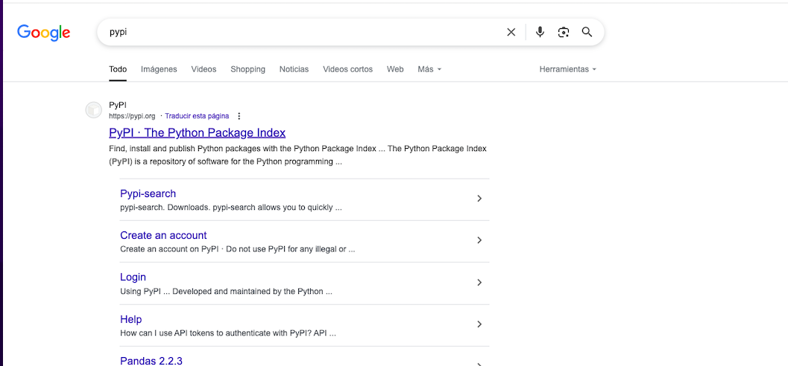
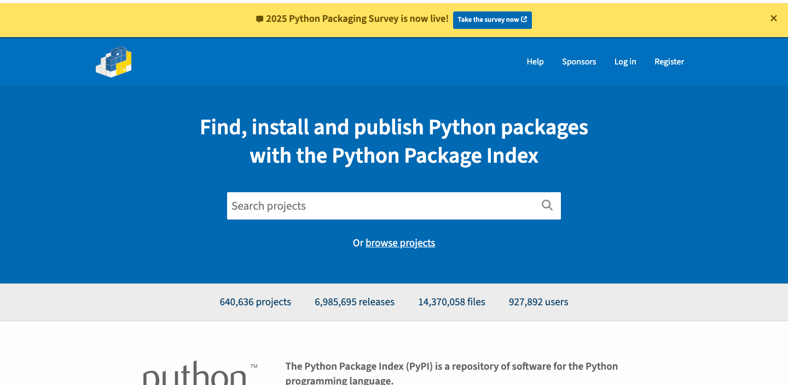

Si buscamos Matplotlib

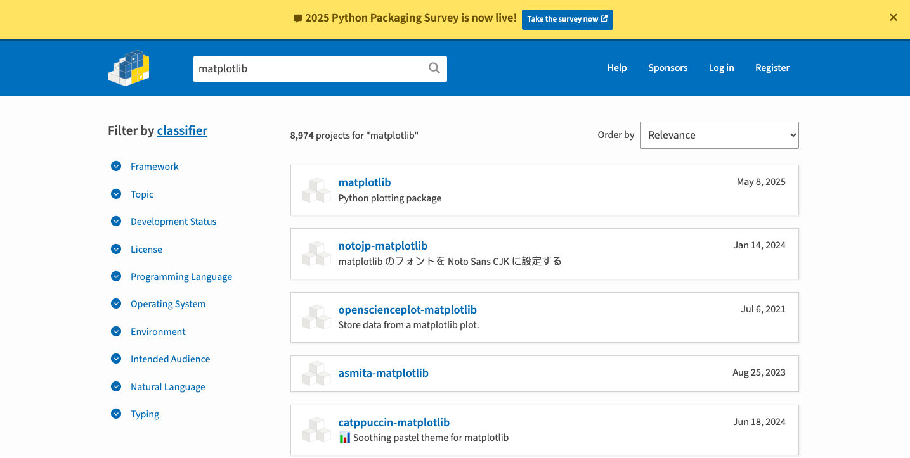

Encontraremos la ultima versión y su codigo de importación
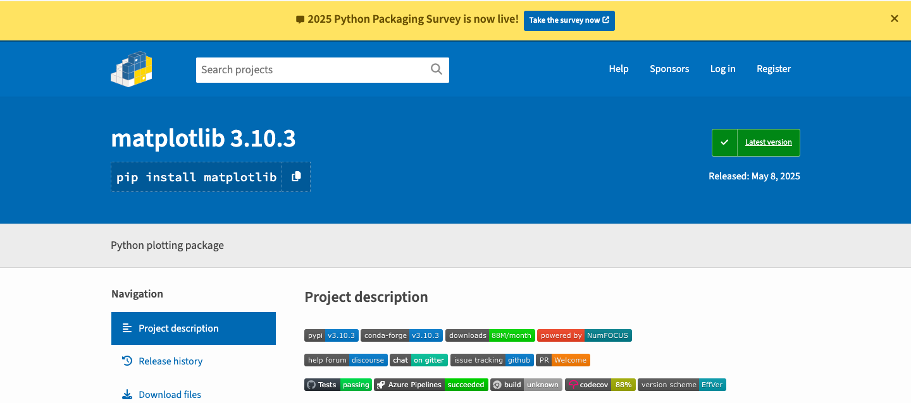

En la documentación veremos ejemplos de usar todos los métodos
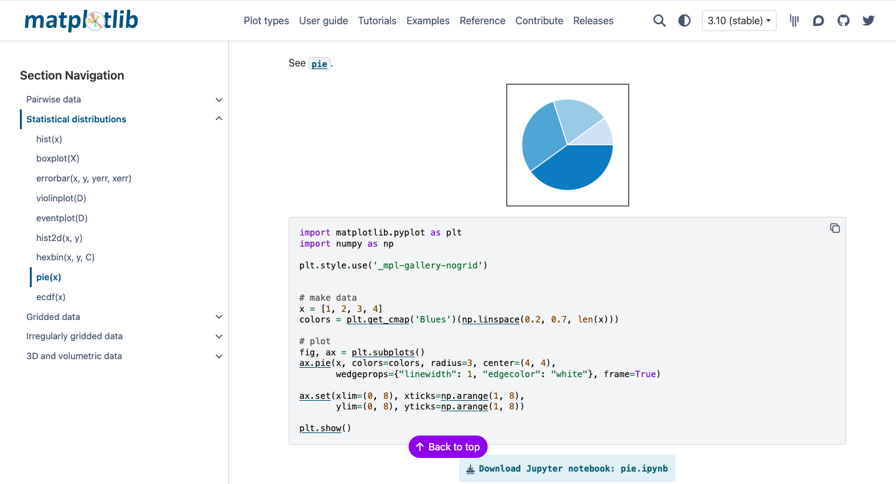

# Siguiente paso en la terminal

ver la versión:
```sh
pip3 -V
```

```sh
pip3
```

# CREAR GRAFICAS

Estando en la carpeta padre project creamos una llamada charts

```sh
mkdir charts
```

entramos a charts

```sh
cd charts
```

Estando en charts instalamos la libreria matplotlib

```sh
pip3 install matplotlib
```

Para ver qué librerias estan instaladas de manera global en python:

```sh
pip3 freeze
```

Entramos a charts y creamos un archivo main.py y otro llamado charts.py

En /charts/charts.py

ver codigo: es un modulo (si usamos lo que esta en verde va mostrar la grafica)

Vamos a /charts/main.py

ver codigo: creamos el script

ejecutamos el script:

```sh
python3 main.py
```

Esto crea un archivo llamado .pie.png como estaba declarado en el método charts.py

Estás aplicando una buena práctica de organización de código que es muy común en desarrollo profesional. Te explico para qué sirve tener charts.py separado de main.py:

# ¿Cuál es la funcionalidad de separar charts.py y main.py?
La idea es modularizar tu proyecto. Esto tiene muchas ventajas:

 1. Reutilización de código
El archivo charts.py puede usarse desde otros scripts o proyectos.

Por ejemplo, si luego haces graphs.py, podrías importar generate_pie_chart() desde charts.py sin copiar y pegar el código.

```python
from charts import generate_pie_chart
generate_pie_chart()
```

2. Separación de responsabilidades
charts.py: contiene funciones que generan gráficos (lógica de visualización).

main.py: es el punto de entrada del programa, que controla el flujo.

Esto es una práctica de programación llamada "separación de preocupaciones", muy usada en software profesional.

3. Fácil mantenimiento
Si mañana decides que el gráfico debe tener nuevos colores o valores, solo modificas charts.py.

main.py no cambia: solo se encarga de ejecutar.

4. Automatización y producción
Guardar el gráfico con plt.savefig(".pie.png") en vez de plt.show() es útil cuando:

Estás generando gráficos automáticamente (por ejemplo, con muchos archivos o datos).

No tienes interfaz gráfica (por ejemplo, en un servidor o en un script que se ejecuta en segundo plano).

Quieres incluir la imagen en un reporte, web o PDF.

# Si tu proyecto crece, puedes tener módulos como:


proyecto/
├── charts.py         # funciones para gráficos
├── data.py           # funciones para cargar/limpiar datos
├── analysis.py       # lógica de análisis
└── main.py           # ejecuta todo
Eso es mucho más escalable y profesional que tener todo mezclado en un solo archivo.

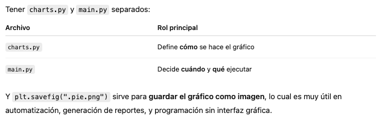


## Proyecto CSV

Creamos una carpeta llamada app, y descargamos unos archivos ya configurados

En /app/charts.py

Vamos a cambiar los métodos show() por métodos de guardar para que el programa no se detenga:

cambiamos 

```python
plt.show()
```

por 

```python
    plt.savefig(".name.png")
    plt.close()
```

Entramos la main.py y dejamos correr todo el programa.

# Con los cambios hechos, corremos el programa

En la terminal ejecutamos:

```sh
    pwd
```

luego 

```sh
    cd ..
```

para regresar a la carpeta padre y entramos en app

```sh
    cd app
```

consultamos los archivos con 

```sh
    ls
```

corremos nuestro archivo main.py

```sh
    python3 main.py
```

Salió error, respecto a la ubicación de la data, se hace la correccion en el archivo main.py
se cambio ./app/data.csv  por data.csv

Esto genera dos archivos o imagenes   .bar.png y .pie.png

# Generar nuevamente las imagenes con ajustes en el nombre de las imagenes

Vamos a app/charts.py y agregamos un nombre:

```python
def generate_bar_chart(labels, values)
```

de esta forma: 

```python
def generate_bar_chart(name, labels, values)
```

y cambiamos:

```python
plt.savefig(".bar.png") 
```

por: 

```python
plt.savefig(f".imgs/{name}.png") 
```

Luego en app/main.py hacemos un cambio:

```python
charts.generate_bar_chart(labels, values)
```

por:
```python
charts.generate_bar_chart(country, labels, values)
```

Volvemos a ejecutar:

```sh
python3 main.py
```

No esta ejecutando imagen. Vamos al archivo main.py,

debajo de 

```python
country = input('Type Country => ')
```

Escribimos

```python
print(country)
```

Sigue generando error, y sucede porque en charts estamos asumiendo que hay una carpeta llamada imgs para las imagenes pero no ha sido creada

```python
plt.savefig(f".imgs/{name}.png") 
```

por lo tanto en la terminal la vamos a crear:

mostramos el contenido de app:

```sh
ls
```

creamos la carpeta imgs:

```sh
mkdir imgs
```

verificamos que este creada:

```sh
ls
```

Volvemos a ejecutar main.py:

```sh
python3 main.py
```

Ha sifo creada la grafica con la información del pais ingresado en el input

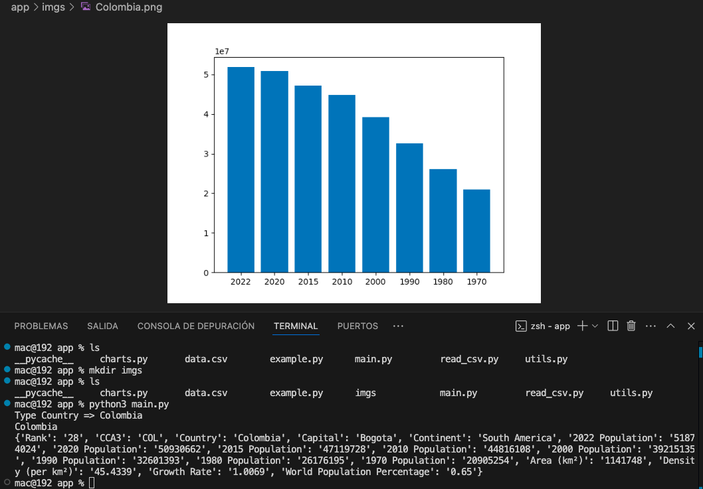


# AMBIENTES VIRTUALES.

En este momento del proyecto estamos usando python y sus recursos instalados en la maquina a nivel global

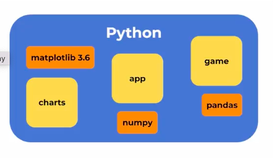

Todas las carpetas y proyectos se comparten modulos, lo que puede generar un problema en el sistema como colapsos y errores debido a que cada proyecto o app requiere versiones diferentes de una misma librería. 

# El entorno virtual:

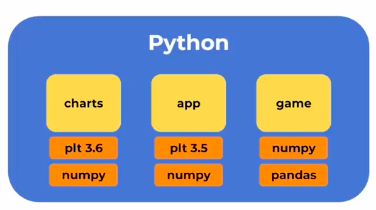

Genera espacios propios para que cada proyecto o app maneje sus propias versiones. 

# Revisar versiones Pypi

https://pypi.org/search/?q=matplotlib

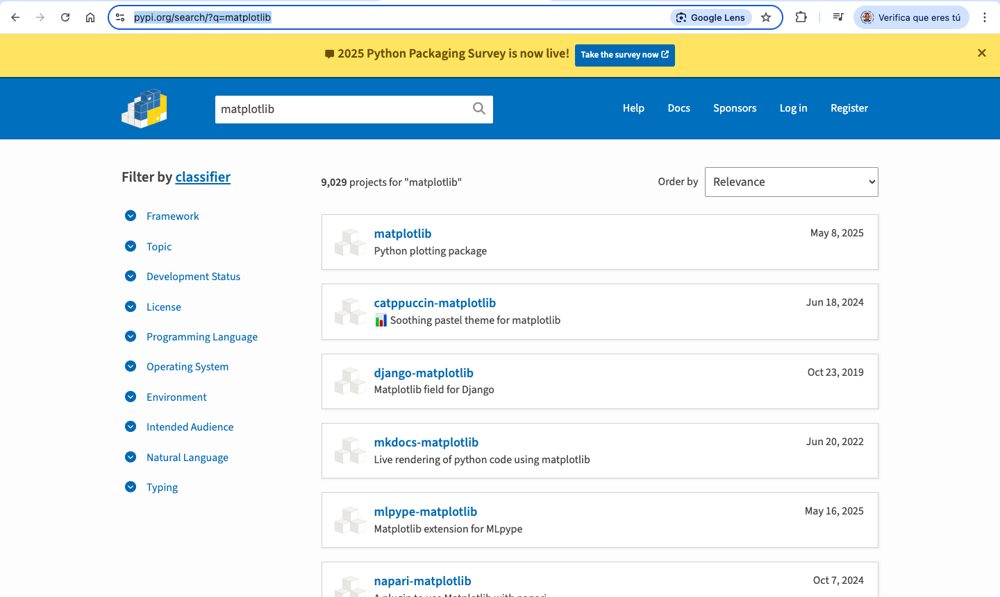

Podemos verificar todas las versiones:

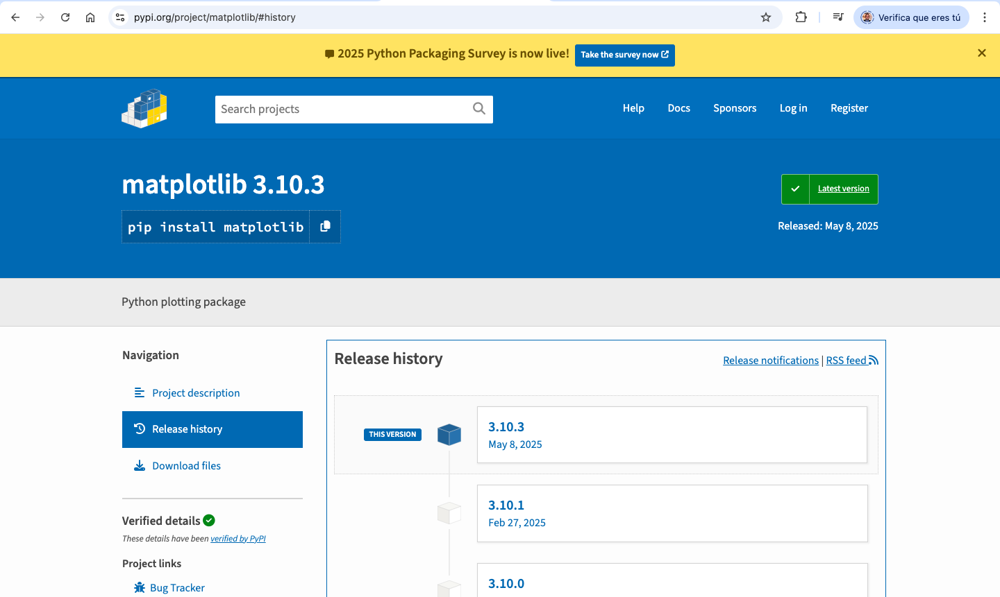

verifiquemos que dependencias estan instaladas:


```sh
pip3 freeze
```

Veremos las versiones de los paquetes instalados:

```sh
mac@192 app % pip3 freeze
appnope==0.1.4
asttokens==2.4.1
blinker==1.9.0
click==8.1.8
comm==0.2.2
contourpy==1.2.1
cycler==0.12.1
debugpy==1.8.2
decorator==5.1.1
dnspython==2.7.0
executing==2.0.1
Flask==3.1.0
fonttools==4.53.0
ipykernel==6.29.5
ipython==8.26.0
itsdangerous==2.2.0
jedi==0.19.1
Jinja2==3.1.6
joblib==1.5.0
jupyter_client==8.6.2
jupyter_core==5.7.2
kiwisolver==1.4.5
lxml==5.3.0
MarkupSafe==3.0.2
matplotlib==3.9.0
matplotlib-inline==0.1.7
mysql-connector==2.2.9
mysql-connector-python==8.3.0
nest-asyncio==1.6.0
numpy==2.0.0
packaging==24.1
pandas==2.2.2
parso==0.8.4
pexpect==4.9.0
pillow==10.3.0
platformdirs==4.2.2
prompt_toolkit==3.0.47
psutil==6.0.0
psycopg2==2.9.10
ptyprocess==0.7.0
pure-eval==0.2.2
pybullet==3.2.7
pygame==2.5.2
Pygments==2.18.0
pymongo==4.12.1
PyMySQL==1.1.0
pyparsing==3.1.2
python-dateutil==2.9.0.post0
python-docx==1.1.2
pytz==2024.1
pyzmq==26.0.3
scikit-learn==1.6.1
scipy==1.15.3
seaborn==0.13.2
setuptools==69.5.1
six==1.16.0
stack-data==0.6.3
threadpoolctl==3.6.0
tornado==6.4.1
traitlets==5.14.3
typing_extensions==4.12.2
tzdata==2024.1
wcwidth==0.2.13
Werkzeug==3.1.3
wheel==0.43.0
mac@192 app %  
```

# Cómo cambiar la versión de matplotlib o algun otro paquete?

Usamos el siguiente comando en la terminal especificando la versión que queremos:

Ejemplo: 

```sh
pip3 install matplotlib==3.5.0
```
Desinstalará la anterior versión e instalará la nueva.

Si esto modulos los tenemos todos en un mismo ambiente, genera colapsos y errores, por esta razón es importante el uso de ambientes virtuales. 

## USO DE AMBIENTES VIRTUALES

Codigo terminal para ver de donde se esta ejecutando python (el binario del entorno global):

```sh
which python3
```

arroja algo como:

```sh
/Library/Frameworks/Python.framework/Versions/3.12/bin/python3
```

de igual manera lo podemos ver con pip:

```sh
which pip3
```
nos arroja algo como:

```sh
/Library/Frameworks/Python.framework/Versions/3.12/bin/pip3
```
Lo anterior cambiaría si trabajamos con ambientes virtuales.


Nota: si estamos en linux se debe instalar por la terminal:

```sh
sudo app install -y python3-venv
```

Seguidamente vamos a verificar los proyectos: app, charts y game:

```sh
ls
```

Queremos que cada uno de los anteriores mencionados tengan su propio ambiente.
Para esto vamos a ingresar a carpeta por directorio por medio cd y generar el ambiente:

# app

Primero entramos a app:

```sh
cd app
```

una vez dentro del directorio generamos el ambien dandole un nombre al ambiente virtual:

```sh
python3 -m vnev name
```

en name nombramos nuestro ambiente, ejemplo: env_app

```sh
python3 -m venv env_app
```

y con ls verificamos que carpeta se creo:

```sh
ls
```

veremos una carpeta o directorio que se acaba de crear con el nombre que le dimos al ambiente virtual

Despues de crear el ambien, se debe

# Activar el ambiente virtual.

lo hacemos con el comando source nombre_del_ambiente/bin/activate

en nuestro caso:

```sh
source env_app/bin/activate
```

genera algo como:

```sh
mac@MacBook-Air-de-mac app % source env_app/bin/activate
(env_app) mac@MacBook-Air-de-mac app %
```

En este momento estamos dentro del ambiente virtual, tambien podemos salir de él:

```sh
deactivate
```

Volvamos a entrar:

```sh
source env_app/bin/activate
```

Estando dentro, vamos a verificar la ubicación de python 

```sh
which python3
```
Ahora nos arroja que estamos en el binario pero dentro de ambiente virtual:

```sh
(env_app) mac@MacBook-Air-de-mac app % which python3
/Users/mac/Desktop/PLATZI/PLATZI_2025/RUTAS/Data_e_inteligencia_artificial/CURSOS ALTERNOS/Python_pip_entornos_virtuales/project/app/env_app/bin/python3
```
Lo mismo va a ocurrir con pip3

Si ejecutamos:

```sh
pip3 freeze
```
No arrojará nada, porque ahora el pip esta aislado y no hemos instalado ningun modulo en el ambiente virtual

Vamos a instalar únicamente modulos que estemos instalando, por ejemplo matplotlib,
por lo tanto vamos a ejecurtar el comando terminal solo para instalar matplotlib:

```sh
pip3 install matplotlib
```
Verificamos que este instalado con: 

```sh
pip3 freeze
```

ahora ya no sale vacio, sale:

(env_app) mac@MacBook-Air-de-mac app % pip3 freeze
contourpy==1.3.2
cycler==0.12.1
fonttools==4.58.2
kiwisolver==1.4.8
matplotlib==3.10.3
numpy==2.3.0
packaging==25.0
pillow==11.2.1
pyparsing==3.2.3
python-dateutil==2.9.0.post0
six==1.17.0

Vemos como marplotlib instalo otras dependencias porque las necesita.
Pero estas dependencias, son aisladas, solamente para este proyecto.

Ahora, vamos a instalar matplotlib en los otros dos proyectos: charts y game pero vamos a 
instalar versiones diferentes para ver el aprovechamiento de manejar ambientes virtuales.

Para esto, salgamos del ambiente actual:

```sh
deactivate
```

# Entremos a otro proyecto, para nentrar a game:

primero salimos a la carpeta padre:

```sh
cd ..
```

buscamos las carpetas o directorios que tenemos:

```sh
ls
```

y entamos al directorio game:

```sh
cd game
```

Creamos el ambiente virtual:

en name nombramos nuestro ambiente, ejemplo: env_game

```sh
python3 -m venv env_game
```
y lo activamos:

```sh
source env_game/bin/activate
```

verificamos que tiene instalado el ambiente (como recien lo creamos debe estar vacio):

```sh
pip3 freeze
```

y en este ejemplo, vamos a instalar matplotlib pero con una versión anterior a la del dirtorio app,
por ejemplo matplotlib==3.9.0

```sh
pip3 install matplotlib==3.9.0
```

una vez instalado, verifamos lo que se ha instala con sus respectivas versiones:

```sh
pip3 freeze
```

vemos que se instalo matplotlib en la versión 3.9.0 y otras dependencias:

(env_game) mac@MacBook-Air-de-mac game % pip3 freeze
contourpy==1.3.2
cycler==0.12.1
fonttools==4.58.2
kiwisolver==1.4.8
matplotlib==3.9.0
numpy==2.3.0
packaging==25.0
pillow==11.2.1
pyparsing==3.2.3
python-dateutil==2.9.0.post0
six==1.17.0


salimos del entorno virtual

```sh
deactivate
```


# Ambien virtual de charts

Entamos al directorio charts:

```sh
cd game
```

Creamos el ambiente virtual:

en name nombramos nuestro ambiente, ejemplo: env_game

```sh
python3 -m venv env_charts
```
y lo activamos:

```sh
source env_charts/bin/activate
```

Con esto cada proyecto tiene sus propios modulos de forma aislados.


## requirements.txt  "otra forma de mantener modulos en proyectos específicos"

Es un archivo que maneja todas las dependencias requeridas en las versiones que se necesitan

Estando en project miremos los proyecto actuales:

```sh
ls
```

Entremos a app, donde hay imagenes y entorno virtual instalado:

```sh
cd app
```

Activemos el entorno virtual:

```sh
source env_app/bin/activate
```

Verifiquemos que dependencias estan en el proyecto app:

```sh
pip3 freeze
```

nos arroja esto:

(env_app) mac@192 app % pip3 freeze
contourpy==1.3.2
cycler==0.12.1
fonttools==4.58.2
kiwisolver==1.4.8
matplotlib==3.10.3
numpy==2.3.0
packaging==25.0
pillow==11.2.1
pyparsing==3.2.3
python-dateutil==2.9.0.post0
six==1.17.0

Supongamos que queremos instalar mas dependencias de forma automatizada y no manual con "pip3 install _______"

Generamos el archivo con comando en la terminal de output >

```sh
pip3 freeze > requiriments.txt
```

Con esto se crea el archivo requiriments.txt con el siguiente contenido:

contourpy==1.3.2
cycler==0.12.1
fonttools==4.58.2
kiwisolver==1.4.8
matplotlib==3.10.3
numpy==2.3.0
packaging==25.0
pillow==11.2.1
pyparsing==3.2.3
python-dateutil==2.9.0.post0
six==1.17.0

comando para leer el archivo:

```sh
cat requiriments.txt
```

Ahora podemos instalar dependencias desde una sola linea de comando en la terminal:

```sh
pip3 install -r requiriments.txt
```
Con esto queda instalado las dependencias necesarias para que funcione el proyecto


## USAR EL PROYECTO (otra persona que se conecte al proyecto)

primero:

```sh
git clone      #clonar el proyecto
cd app
source env_app/bin/activate   #activar el entorno virtual
pip3 install -r requiriments.txt #instalar las dependencias para que funcione el entorno.
python3 main.py   #Hacer funcionar la aplicación
```

# Actualicemos en git


 


.
.
.

siguiente curso recomendado:Curso de Fundamentos de Procesamiento de Lenguaje Natural con Python y NLTK

Volver a la ruta de: Data e inteligencia artificial
