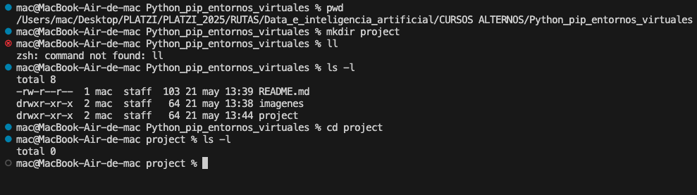
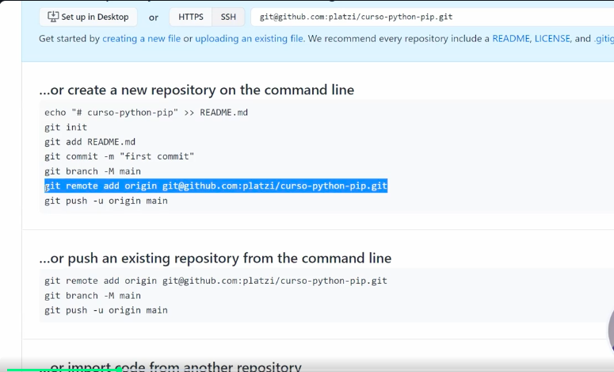
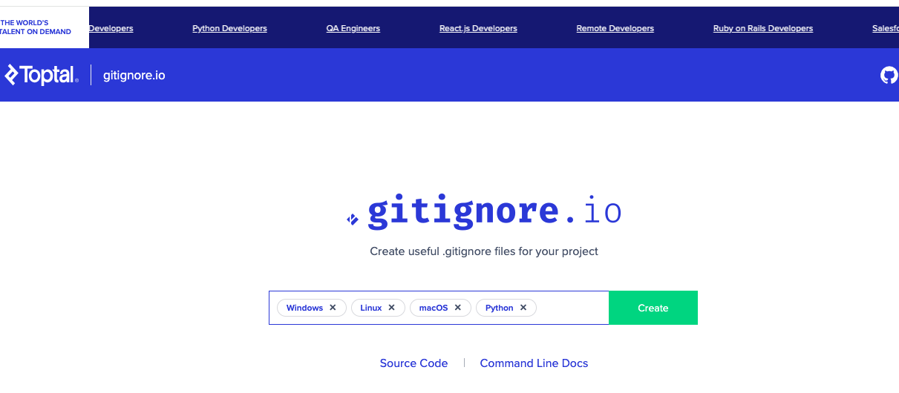

## Curso de Python: PIP y Entornos Virtuales

## Clase 1: Python en tu propio entorno de desarrollo local

En la terminal ejecutamos:

pwd:
    (Print Working Directory,Sirve para mostrar la ruta completa (path) de la carpeta en la que te encuentras actualmente en la terminal.)

mkdir project:
    (make directory, Crea una nueva carpeta llamada project dentro de la ruta en la que estás ubicado actualmente.)

ls -l:
    (Estás listando el contenido de la carpeta actual con más detalles.)

ls:
    (para listar el contenido sin detalles)

cd project:
    (change directory, Cambia tu ubicación actual a la carpeta llamada project.)

clear:
    (limpiar terminal)

## INICIALIZAR EL PROYECTO EN GIT

Ejecutamos:

1. git init:
        (inicializar un repositorio Git vacío)
2. touch hello.py:
        (crea un archivo en este caso llamado hello.py)
3. ejecutamos ls -l para ver el nuevo archivo creado en la terminal.

## Instalación de Python

verificar si esta instalado buscando la versión: python3 -V
si no responde con una versión, quiere decir que se debe instalar

sudo xcode-select --install: 
    
    Se usa en macOS para instalar las herramientas de línea de comandos de Xcode, que incluyen compiladores y utilidades necesarias para compilar paquetes Python que requieren código nativo (por ejemplo, algunas librerías que necesitan ser compiladas al instalarse con pip).

brew install python3:
    para instalar python en mac

python3:
    para iniciar python en la terminal

exit():
    para salir de python desde la terminal

python3 archivo.py:
    para abrir un archivo.py desde la terminal (se debe estar en la carpeta o entorno donde esta el archivo)

## GIT y GIT HUB

Crear una cuenta en github

Crear nuevo repository

(caracter públic)

crear

Seguidamente tomamos la linea de codigo para conectar desde nuestra terminal:

primero: git init

segundo:
git remote add origin git@github.com:joanflorez-alt/curso_python_pip_env.git

otra alternativa:
git add . (para agregar todo)

git status (para verificar estatus)

git commit -m "Primer commit del proyecto" (agregar el primer commit)

git push origin main

#CREAR EL GITIGNORE: los archivos que vamos a ignorar y no queremos que sean parte de repositorio.

https://www.toptal.com/developers/gitignore

o escribir gitignore io

seleccionamos los sistemas operativos y el lenguaje de programación usado

el codigo generado lo guardamos en un archivo llamado: .gitignore

## PIP
# ¿Qué es pip?
pip es el gestor de paquetes oficial para Python.

# ¿Para qué sirve?
Permite instalar, actualizar y desinstalar librerías o paquetes de Python fácilmente desde la línea de comandos.

Descarga las librerías desde el repositorio oficial llamado PyPI (Python Package Index).

Te ayuda a usar código ya hecho por otros para no tener que programar todo desde cero.

# Verificar instalación
verificar pip esta instalado: pip3 -V

La respuesta: pip 25.0.1 from /Library/Frameworks/Python.framework/Versions/3.12/lib/python3.12/site-packages/pip (python 3.12)

 Actualmente estamos usando el pip del sistema, no el de un entorno virtual.

# Paso a seguir, crear el entorno virtual.

.
.
.

siguiente curso recomendado:Curso de Fundamentos de Procesamiento de Lenguaje Natural con Python y NLTK

Volver a la ruta de: Data e inteligencia artificial
