para buscar: cmd  +  F
para visualizar: cmd + altizq + v
para guardar: cmd + s


## Curso de Python: PIP y Entornos Virtuales

## Clase 1: Python en tu propio entorno de desarrollo local


En la terminal ejecutamos:

pwd:
    (Print Working Directory,Sirve para mostrar la ruta completa (path) de la carpeta en la que te encuentras actualmente en la terminal.)

mkdir project:
    (make directory, Crea una nueva carpeta llamada project dentro de la ruta en la que estás ubicado actualmente.)

ls -l:
    (Estás listando el contenido de la carpeta actual con más detalles.)

ls:
    (para listar el contenido sin detalles)

cd project:
    (change directory, Cambia tu ubicación actual a la carpeta llamada project.)

clear:
    (limpiar terminal)

## INICIALIZAR EL PROYECTO EN GIT

Ejecutamos:

1. git init:
        (inicializar un repositorio Git vacío)
2. touch hello.py:
        (crea un archivo en este caso llamado hello.py)
3. ejecutamos ls -l para ver el nuevo archivo creado en la terminal.

## Instalación de Python

verificar si esta instalado buscando la versión: python3 -V
si no responde con una versión, quiere decir que se debe instalar

sudo xcode-select --install: 
    
    Se usa en macOS para instalar las herramientas de línea de comandos de Xcode, que incluyen compiladores y utilidades necesarias para compilar paquetes Python que requieren código nativo (por ejemplo, algunas librerías que necesitan ser compiladas al instalarse con pip).

brew install python3:
    para instalar python en mac

python3:
    para iniciar python en la terminal

exit():
    para salir de python desde la terminal

python3 archivo.py:
    para abrir un archivo.py desde la terminal (se debe estar en la carpeta o entorno donde esta el archivo)

## GIT y GIT HUB

Crear una cuenta en github

Crear nuevo repository

(caracter públic)

crear

Seguidamente tomamos la linea de codigo para conectar desde nuestra terminal:


primero: 

```sh
git init
```

segundo:
git remote add origin git@github.com:joanflorez-alt/curso_python_pip_env.git

otra alternativa:
git add . (para agregar todo)

git status (para verificar estatus)

git commit -m "Primer commit del proyecto" (agregar el primer commit)

git push origin main


#CREAR EL GITIGNORE: los archivos que vamos a ignorar y no queremos que sean parte de repositorio.

https://www.toptal.com/developers/gitignore

o escribir gitignore io

seleccionamos los sistemas operativos y el lenguaje de programación usado


el codigo generado lo guardamos en un archivo llamado: .gitignore


(Guardamos en git lo hecho)
git add .
git commit -m "add files 26/5/25"
git push origin main

## FLUJO DE TRABAJO

creamos la carpeta game
Creamos el archivo main.py y pegamos el codigo tomado de la fuente  (ver code)
abrimos desde la terminal, entrando a la carpeta game

cd game

y abrimos el archivo:

python3 main.py

```sh
cd game
python3 main.py
```

usamos el juego

nos regresamos a la carpeta padre: cd ..
corroboramos donde estamosubicado: pwd

(Guardamos en git lo hecho)
git add .
git commit -m "add files 27/5/25"
git push origin main


## PIP
# ¿Qué es pip?
pip es el gestor de paquetes oficial para Python.

# ¿Para qué sirve?
Permite instalar, actualizar y desinstalar librerías o paquetes de Python fácilmente desde la línea de comandos.

Descarga las librerías desde el repositorio oficial llamado PyPI (Python Package Index)o PIP

Te ayuda a usar código ya hecho por otros para no tener que programar todo desde cero.

# Verificar instalación
verificar pip esta instalado: pip3 -V

La respuesta: pip 25.0.1 from /Library/Frameworks/Python.framework/Versions/3.12/lib/python3.12/site-packages/pip (python 3.12)

 Actualmente estamos usando el pip del sistema, no el de un entorno virtual.

# CONOZCAMOS MAS DE PIP

Entramos a: pypi


Si buscamos Matplotlib


Encontraremos la ultima versión y su codigo de importación


En la documentación veremos ejemplos de usar todos los métodos


# Siguiente paso en la terminal

ver la versión:
```sh
pip3 -V
```

```sh
pip3
```

# CREAR GRAFICAS

Estando en la carpeta padre project creamos una llamada charts

```sh
mkdir charts
```

entramos a charts

```sh
cd charts
```

Estando en charts instalamos la libreria matplotlib

```sh
pip3 install matplotlib
```

Para ver qué librerias estan instaladas de manera global en python:

```sh
pip3 freeze
```

Entramos a charts y creamos un archivo main.py y otro llamado charts.py

En /charts/charts.py

ver codigo: es un modulo (si usamos lo que esta en verde va mostrar la grafica)

Vamos a /charts/main.py

ver codigo: creamos el script

ejecutamos el script:

```sh
python3 main.py
```

Esto crea un archivo llamado .pie.png como estaba declarado en el método charts.py

Estás aplicando una buena práctica de organización de código que es muy común en desarrollo profesional. Te explico para qué sirve tener charts.py separado de main.py:

# ¿Cuál es la funcionalidad de separar charts.py y main.py?
La idea es modularizar tu proyecto. Esto tiene muchas ventajas:

 1. Reutilización de código
El archivo charts.py puede usarse desde otros scripts o proyectos.

Por ejemplo, si luego haces graphs.py, podrías importar generate_pie_chart() desde charts.py sin copiar y pegar el código.

```python
from charts import generate_pie_chart
generate_pie_chart()
```

2. Separación de responsabilidades
charts.py: contiene funciones que generan gráficos (lógica de visualización).

main.py: es el punto de entrada del programa, que controla el flujo.

Esto es una práctica de programación llamada "separación de preocupaciones", muy usada en software profesional.

3. Fácil mantenimiento
Si mañana decides que el gráfico debe tener nuevos colores o valores, solo modificas charts.py.

main.py no cambia: solo se encarga de ejecutar.

4. Automatización y producción
Guardar el gráfico con plt.savefig(".pie.png") en vez de plt.show() es útil cuando:

Estás generando gráficos automáticamente (por ejemplo, con muchos archivos o datos).

No tienes interfaz gráfica (por ejemplo, en un servidor o en un script que se ejecuta en segundo plano).

Quieres incluir la imagen en un reporte, web o PDF.

# Si tu proyecto crece, puedes tener módulos como:


proyecto/
├── charts.py         # funciones para gráficos
├── data.py           # funciones para cargar/limpiar datos
├── analysis.py       # lógica de análisis
└── main.py           # ejecuta todo
Eso es mucho más escalable y profesional que tener todo mezclado en un solo archivo.


## Proyecto CSV

Creamos una carpeta llamada app, y descargamos unos archivos ya configurados

En /app/charts.py

Vamos a cambiar los métodos show() por métodos de guardar para que el programa no se detenga:

cambiamos 

```python
plt.show()
```

por 

```python
    plt.savefig(".name.png")
    plt.close()
```

Entramos la main.py y dejamos correr todo el programa.

# Con los cambios hechos, corremos el programa

En la terminal ejecutamos:

```sh
    pwd
```

luego 

```sh
    cd ..
```

para regresar a la carpeta padre y entramos en app

```sh
    cd app
```

consultamos los archivos con 

```sh
    ls
```

corremos nuestro archivo main.py

```sh
    python3 main.py
```

Salió error, respecto a la ubicación de la data, se hace la correccion en el archivo main.py
se cambio ./app/data.csv  por data.csv

Esto genera dos archivos o imagenes   .bar.png y .pie.png

# Generar nuevamente las imagenes con ajustes en el nombre de las imagenes

Vamos a app/charts.py y agregamos un nombre:

```python
def generate_bar_chart(labels, values)
```

de esta forma: 

```python
def generate_bar_chart(name, labels, values)
```

y cambiamos:

```python
plt.savefig(".bar.png") 
```

por: 

```python
plt.savefig(f".imgs/{name}.png") 
```

Luego en app/main.py hacemos un cambio:

```python
charts.generate_bar_chart(labels, values)
```

por:
```python
charts.generate_bar_chart(country, labels, values)
```

Volvemos a ejecutar:

```sh
python3 main.py
```

No esta ejecutando imagen. Vamos al archivo main.py,

debajo de 

```python
country = input('Type Country => ')
```

Escribimos

```python
print(country)
```

Sigue generando error, y sucede porque en charts estamos asumiendo que hay una carpeta llamada imgs para las imagenes pero no ha sido creada

```python
plt.savefig(f".imgs/{name}.png") 
```

por lo tanto en la terminal la vamos a crear:

mostramos el contenido de app:

```sh
ls
```

creamos la carpeta imgs:

```sh
mkdir imgs
```

verificamos que este creada:

```sh
ls
```

Volvemos a ejecutar main.py:

```sh
python3 main.py
```

Ha sifo creada la grafica con la información del pais ingresado en el input


# AMBIENTES VIRTUALES.

En este momento del proyecto estamos usando python y sus recursos instalados en la maquina a nivel global


Todas las carpetas y proyectos se comparten modulos, lo que puede generar un problema en el sistema como colapsos y errores debido a que cada proyecto o app requiere versiones diferentes de una misma librería. 

# El entorno virtual:


Genera espacios propios para que cada proyecto o app maneje sus propias versiones. 

# Revisar versiones Pypi

https://pypi.org/search/?q=matplotlib


Podemos verificar todas las versiones:


verifiquemos que dependencias estan instaladas:


```sh
pip3 freeze
```

Veremos las versiones de los paquetes instalados:

```sh
mac@192 app % pip3 freeze
appnope==0.1.4
asttokens==2.4.1
blinker==1.9.0
click==8.1.8
comm==0.2.2
contourpy==1.2.1
cycler==0.12.1
debugpy==1.8.2
decorator==5.1.1
dnspython==2.7.0
executing==2.0.1
Flask==3.1.0
fonttools==4.53.0
ipykernel==6.29.5
ipython==8.26.0
itsdangerous==2.2.0
jedi==0.19.1
Jinja2==3.1.6
joblib==1.5.0
jupyter_client==8.6.2
jupyter_core==5.7.2
kiwisolver==1.4.5
lxml==5.3.0
MarkupSafe==3.0.2
matplotlib==3.9.0
matplotlib-inline==0.1.7
mysql-connector==2.2.9
mysql-connector-python==8.3.0
nest-asyncio==1.6.0
numpy==2.0.0
packaging==24.1
pandas==2.2.2
parso==0.8.4
pexpect==4.9.0
pillow==10.3.0
platformdirs==4.2.2
prompt_toolkit==3.0.47
psutil==6.0.0
psycopg2==2.9.10
ptyprocess==0.7.0
pure-eval==0.2.2
pybullet==3.2.7
pygame==2.5.2
Pygments==2.18.0
pymongo==4.12.1
PyMySQL==1.1.0
pyparsing==3.1.2
python-dateutil==2.9.0.post0
python-docx==1.1.2
pytz==2024.1
pyzmq==26.0.3
scikit-learn==1.6.1
scipy==1.15.3
seaborn==0.13.2
setuptools==69.5.1
six==1.16.0
stack-data==0.6.3
threadpoolctl==3.6.0
tornado==6.4.1
traitlets==5.14.3
typing_extensions==4.12.2
tzdata==2024.1
wcwidth==0.2.13
Werkzeug==3.1.3
wheel==0.43.0
mac@192 app %  
```

# Cómo cambiar la versión de matplotlib o algun otro paquete?

Usamos el siguiente comando en la terminal especificando la versión que queremos:

Ejemplo: 

```sh
pip3 install matplotlib==3.5.0
```
Desinstalará la anterior versión e instalará la nueva.

Si esto modulos los tenemos todos en un mismo ambiente, genera colapsos y errores, por esta razón es importante el uso de ambientes virtuales. 

## USO DE AMBIENTES VIRTUALES

Codigo terminal para ver de donde se esta ejecutando python (el binario del entorno global):

```sh
which python3
```

arroja algo como:

```sh
/Library/Frameworks/Python.framework/Versions/3.12/bin/python3
```

de igual manera lo podemos ver con pip:

```sh
which pip3
```
nos arroja algo como:

```sh
/Library/Frameworks/Python.framework/Versions/3.12/bin/pip3
```
Lo anterior cambiaría si trabajamos con ambientes virtuales.


Nota: si estamos en linux se debe instalar por la terminal:

```sh
sudo app install -y python3-venv
```

Seguidamente vamos a verificar los proyectos: app, charts y game:

```sh
ls
```

Queremos que cada uno de los anteriores mencionados tengan su propio ambiente.
Para esto vamos a ingresar a carpeta por directorio por medio cd y generar el ambiente:

# app

Primero entramos a app:

```sh
cd app
```

una vez dentro del directorio generamos el ambien dandole un nombre al ambiente virtual:

```sh
python3 -m vnev name
```

en name nombramos nuestro ambiente, ejemplo: env_app

```sh
python3 -m venv env_app
```

y con ls verificamos que carpeta se creo:

```sh
ls
```

veremos una carpeta o directorio que se acaba de crear con el nombre que le dimos al ambiente virtual

Despues de crear el ambien, se debe

# Activar el ambiente virtual.

lo hacemos con el comando source nombre_del_ambiente/bin/activate

en nuestro caso:

```sh
source env_app/bin/activate
```

genera algo como:

```sh
mac@MacBook-Air-de-mac app % source env_app/bin/activate
(env_app) mac@MacBook-Air-de-mac app %
```

En este momento estamos dentro del ambiente virtual, tambien podemos salir de él:

```sh
deactivate
```

Volvamos a entrar:

```sh
source env_app/bin/activate
```

Estando dentro, vamos a verificar la ubicación de python 

```sh
which python3
```
Ahora nos arroja que estamos en el binario pero dentro de ambiente virtual:

```sh
(env_app) mac@MacBook-Air-de-mac app % which python3
/Users/mac/Desktop/PLATZI/PLATZI_2025/RUTAS/Data_e_inteligencia_artificial/CURSOS ALTERNOS/Python_pip_entornos_virtuales/project/app/env_app/bin/python3
```
Lo mismo va a ocurrir con pip3

Si ejecutamos:

```sh
pip3 freeze
```
No arrojará nada, porque ahora el pip esta aislado y no hemos instalado ningun modulo en el ambiente virtual

Vamos a instalar únicamente modulos que estemos instalando, por ejemplo matplotlib,
por lo tanto vamos a ejecurtar el comando terminal solo para instalar matplotlib:

```sh
pip3 install matplotlib
```
Verificamos que este instalado con: 

```sh
pip3 freeze
```

ahora ya no sale vacio, sale:

(env_app) mac@MacBook-Air-de-mac app % pip3 freeze
contourpy==1.3.2
cycler==0.12.1
fonttools==4.58.2
kiwisolver==1.4.8
matplotlib==3.10.3
numpy==2.3.0
packaging==25.0
pillow==11.2.1
pyparsing==3.2.3
python-dateutil==2.9.0.post0
six==1.17.0

Vemos como marplotlib instalo otras dependencias porque las necesita.
Pero estas dependencias, son aisladas, solamente para este proyecto.

Ahora, vamos a instalar matplotlib en los otros dos proyectos: charts y game pero vamos a 
instalar versiones diferentes para ver el aprovechamiento de manejar ambientes virtuales.

Para esto, salgamos del ambiente actual:

```sh
deactivate
```

# Entremos a otro proyecto, para nentrar a game:

primero salimos a la carpeta padre:

```sh
cd ..
```

buscamos las carpetas o directorios que tenemos:

```sh
ls
```

y entamos al directorio game:

```sh
cd game
```

Creamos el ambiente virtual:

en name nombramos nuestro ambiente, ejemplo: env_game

```sh
python3 -m venv env_game
```
y lo activamos:

```sh
source env_game/bin/activate
```

verificamos que tiene instalado el ambiente (como recien lo creamos debe estar vacio):

```sh
pip3 freeze
```

y en este ejemplo, vamos a instalar matplotlib pero con una versión anterior a la del dirtorio app,
por ejemplo matplotlib==3.9.0

```sh
pip3 install matplotlib==3.9.0
```

una vez instalado, verifamos lo que se ha instala con sus respectivas versiones:

```sh
pip3 freeze
```

vemos que se instalo matplotlib en la versión 3.9.0 y otras dependencias:

(env_game) mac@MacBook-Air-de-mac game % pip3 freeze
contourpy==1.3.2
cycler==0.12.1
fonttools==4.58.2
kiwisolver==1.4.8
matplotlib==3.9.0
numpy==2.3.0
packaging==25.0
pillow==11.2.1
pyparsing==3.2.3
python-dateutil==2.9.0.post0
six==1.17.0


salimos del entorno virtual

```sh
deactivate
```


# Ambien virtual de charts

Entamos al directorio charts:

```sh
cd game
```

Creamos el ambiente virtual:

en name nombramos nuestro ambiente, ejemplo: env_game

```sh
python3 -m venv env_charts
```
y lo activamos:

```sh
source env_charts/bin/activate
```

Con esto cada proyecto tiene sus propios modulos de forma aislados.


## requirements.txt  "otra forma de mantener modulos en proyectos específicos"

Es un archivo que maneja todas las dependencias requeridas en las versiones que se necesitan

Estando en project miremos los proyecto actuales:

```sh
ls
```

Entremos a app, donde hay imagenes y entorno virtual instalado:

```sh
cd app
```

Activemos el entorno virtual:

```sh
source env_app/bin/activate
```

Verifiquemos que dependencias estan en el proyecto app:

```sh
pip3 freeze
```

nos arroja esto:

(env_app) mac@192 app % pip3 freeze
contourpy==1.3.2
cycler==0.12.1
fonttools==4.58.2
kiwisolver==1.4.8
matplotlib==3.10.3
numpy==2.3.0
packaging==25.0
pillow==11.2.1
pyparsing==3.2.3
python-dateutil==2.9.0.post0
six==1.17.0

Supongamos que queremos instalar mas dependencias de forma automatizada y no manual con "pip3 install _______"

Generamos el archivo con comando en la terminal de output >

```sh
pip3 freeze > requiriments.txt
```

Con esto se crea el archivo requiriments.txt con el siguiente contenido:

contourpy==1.3.2
cycler==0.12.1
fonttools==4.58.2
kiwisolver==1.4.8
matplotlib==3.10.3
numpy==2.3.0
packaging==25.0
pillow==11.2.1
pyparsing==3.2.3
python-dateutil==2.9.0.post0
six==1.17.0

comando para leer el archivo:

```sh
cat requiriments.txt
```

Ahora podemos instalar dependencias desde una sola linea de comando en la terminal:

```sh
pip3 install -r requiriments.txt
```
Con esto queda instalado las dependencias necesarias para que funcione el proyecto


## USAR EL PROYECTO (otra persona que se conecte al proyecto)

primero:

```sh
git clone      #clonar el proyecto
cd app
python3 -m venv env_name     #creamos el entorno virtual (nuevamente cuando se clona un proyecto desde otro ordenador, y en name va el nombre del entorno)
source env_app/bin/activate   #activar el entorno virtual
pip3 install -r requiriments.txt #instalar las dependencias para que funcione el entorno.
python3 main.py   #Hacer funcionar la aplicación
```

# Actualicemos en git:

```sh
git add .
git commit -m "9/6/25"
git push origin main
```

# Usar FORK en git hub para hacer cambios pero no hacerlos directo sobre el proyecto,
Esperar la aprobación para que se apliquen los cambios hechos.

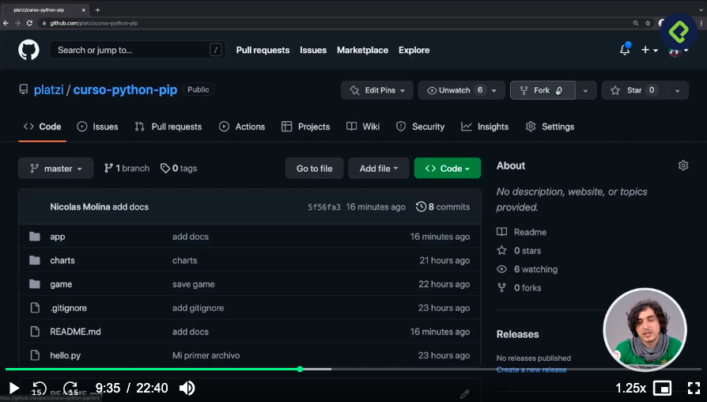

para esto se debe copiar el code de la rama principal

una vez conectado, en la propiar terminal se ingresa al proyecto:

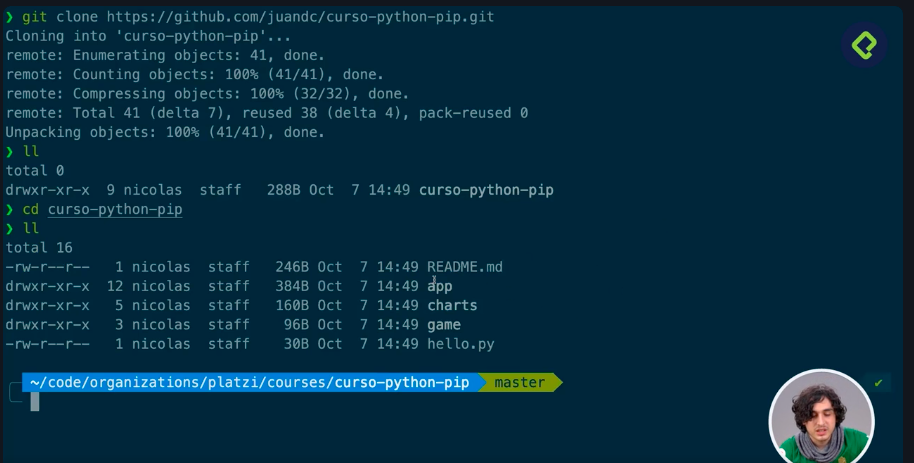

los entornos virtuales se deben crear nuevamente, porque es lo unico que no se puede clonar


Al implementar fork es un pullrequest lo que permite evaluar los cambios antes de aceptarlos, despues de esto verificamos con:

```sh
git status
```

lo anterior nos muestra los cambios hechos.

Ahora unicamente guardemos en git un cambio, por ejemplo que se haya actualizado el README con un paso que faltaba (por ejemplo, crear el entorno virtual antes de activarlo):

```sh
git add README.md
```

luego, el comentario del commit:

```sh
git commit -m "Add docs: create venv)
```

finalmente subimos al repositorio, y le damos comando head para que aguarde en la rama que estamos trabajando:

```sh
git push origin head
```

En git veremos un mensaje que dice: 1 commit ahead of ________ un commit adelantado del git hub original o master.

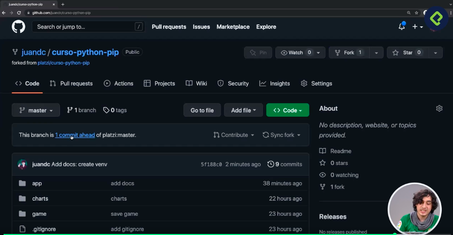

Al entrar en el comentario: 1 commit ahead

dara la oportunidad de hacer un pull request

se puee agregar un mensaje explicando los cambios.

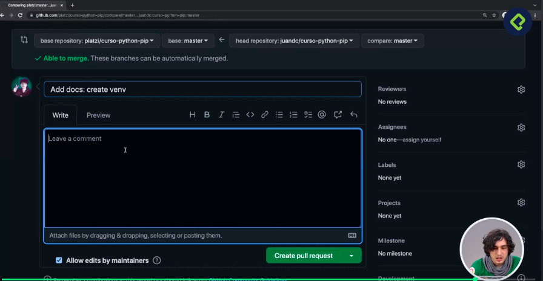


Seguidamente se debe analizar si autorizar o no el Pull request
dando click en Merge Pull request:

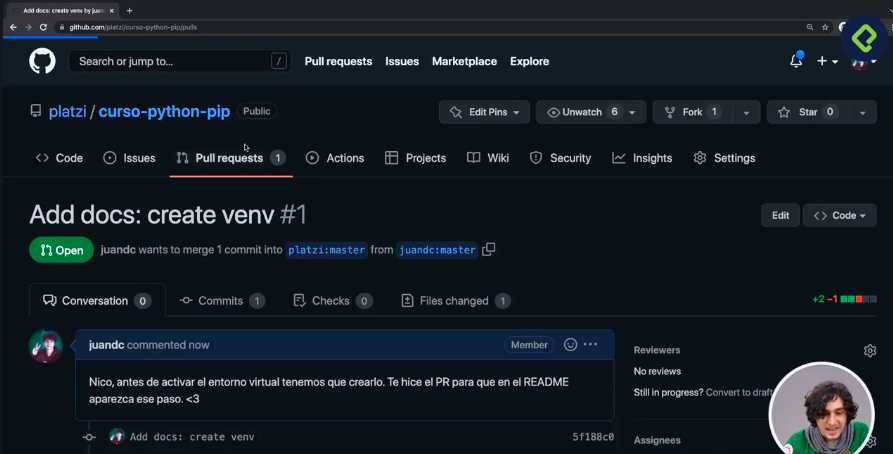

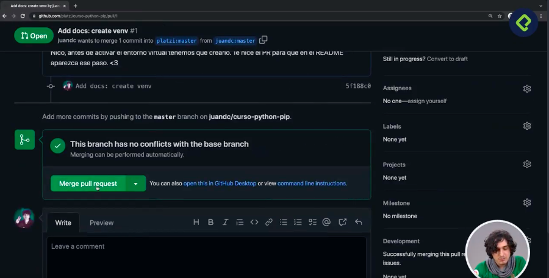


## Solicitudes HTTP con Requests

requests (con "s" al final) es una librería externa de Python muy utilizada para hacer peticiones HTTP de una forma sencilla y amigable. No viene incluida en la biblioteca estándar, por lo que normalmente necesitas instalarla

 
conexiones a servidores web y hacer peticiones

documentación:

https://requests.readthedocs.io/en/latest/

https://github.com/platzi/curso-python-pip/tree/master/web-server


Haremos un requests en la siguiente pagina:

https://fakeapi.platzi.com/

Lo haremos un request o endpoint con el recurso: 

https://api.escuelajs.co/api/v1/categories

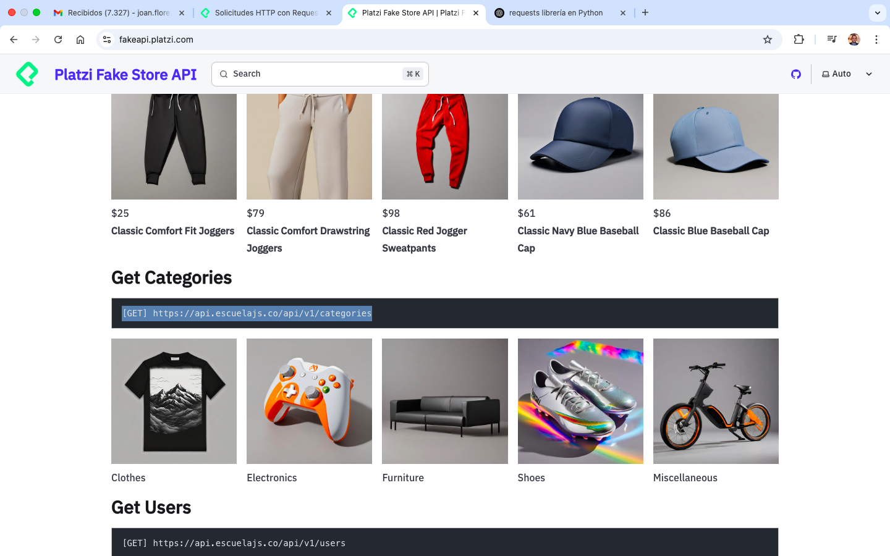

si abrimos: https://api.escuelajs.co/api/v1/categories
como url veremos una lista en formato json:

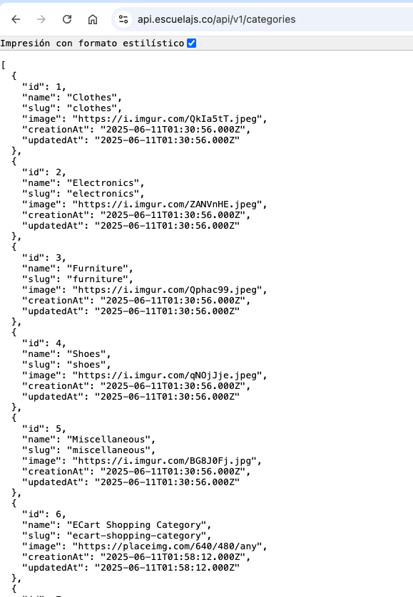

# Emplear el modulo requests

Estando en project verifiquemos el contenido:

```sh
ls
```

Creaemos un nuevo proyecto llamado web_server

```sh
mkdir web_server
```

si estamos en algun entorno virtual podemos verificar de donde es con

```sh
which python3
```

y seguidamente salir de el:

```sh
deactivate
```

Ahora entremos a web_server

```sh
cd web_server
```

creamos el entorno virtual para el nuevo proyecto:

```sh
python3 -m venv env_web
```
Seguidamente activamos el entorno virtual

```sh
source env_web/bin/activate
```

verifiquemos que estamos en el ambiente

```sh
which python3
```
arroja algo como:
(env_web) mac@192 web_server % which python3
/Users/mac/Desktop/PLATZI/PLATZI_2025/RUTAS/Data_e_inteligencia_artificial/CURSOS ALTERNOS/Python_pip_entornos_virtuales/project/web_server/env_web/bin/python3

Ahora instalamos requests

```sh
pip3 install requests
```

seguidamente verificamos la instalación:

```sh
pip3 freeze
```
Arroja lo siguiente:

(env_web) mac@192 web_server % pip3 freeze
certifi==2025.4.26
charset-normalizer==3.4.2
idna==3.10
requests==2.32.4
urllib3==2.4.0

Para que otra persona pueda implementar estas dependencias, por ejemplo con un git clone,
creamos el requeriments

```sh
pip3 freeze > requeriments.txt
```

seguidamente:

```sh
cat requeriments.txt
```

para leer el archivo en la terminal, arrojará:

(env_web) mac@192 web_server % cat requeriments.txt
certifi==2025.4.26
charset-normalizer==3.4.2
idna==3.10
requests==2.32.4
urllib3==2.4.0

# Hacer solicitudes

Haremos la solicitud al API

Creamos un archivo store.py  que seria nuestro modulo

```sh
touch store.py
```

Entramos a store.py:

    importamos requests
    ver code

una vez creado el modulo, creamos el ejecutable que es el main.py en web_server:

```sh
touch main.py
```

Entramos a main.py:
    importamos el modulo store
    ver code... creamos el escript ejecutable 

Seguidamente corremos main.py en nuestro entorno:

```sh
python3 main.py
```

obtenemos la información de la url:

(env_web) mac@192 web_server % python3 main.py
200
[{"id":1,"name":"Clothes","slug":"clothes","image":"https://i.imgur.com/QkIa5tT.jpeg","creationAt":"2025-06-11T01:30:56.000Z","updatedAt":"2025-06-11T01:30:56.000Z"},{"id":2,"name":"Electronics","slug":"electronics","image":"https://i.imgur.com/ZANVnHE.jpeg","creationAt":"2025-06-11T01:30:56.000Z","updatedAt":"2025-06-11T01:30:56.000Z"},{"id":3,"name":"Furniture","slug":"furniture","image":"https://i.imgur.com/Qphac99.jpeg","creationAt":"2025-06-11T01:30:56.000Z","updatedAt":"2025-06-11T01:30:56.000Z"},{"id":4,"name":"Shoes","slug":"shoes","image":"https://i.imgur.com/qNOjJje.jpeg","creationAt":"2025-06-11T01:30:56.000Z","updatedAt":"2025-06-11T01:30:56.000Z"},{"id":5,"name":"Miscellaneous","slug":"miscellaneous","image":"https://i.imgur.com/BG8J0Fj.jpg","creationAt":"2025-06-11T01:30:56.000Z","updatedAt":"2025-06-11T01:30:56.000Z"},{"id":6,"name":"ECart Shopping Category","slug":"ecart-shopping-category","image":"https://placeimg.com/640/480/any","creationAt":"2025-06-11T01:58:12.000Z","updatedAt":"2025-06-11T01:58:12.000Z"},{"id":7,"name":"Testing Category","slug":"testing-category","image":"https://placeimg.com/640/480/any","creationAt":"2025-06-11T02:01:15.000Z","updatedAt":"2025-06-11T02:01:15.000Z"}]

El 200 es un status que significa que todo corrio bien.

Hemos obtenido la información de e commerce en linea 
pero el formato esta en tipo str lo cual no se puede modificar,
si lo queremos modificar debería estar en formato de lista.

# libreria requests transforma en lista

Entramos al modulo store.py y agregamos:

```python
categories = r.json()
for category in categories:
    print(category[name])
```

corremos nuevamente el ejecutable:

```sh
python3 main.py
```

obtenemos:

```sh
env_web) mac@192 web_server % python3 main.py
200
[{"id":1,"name":"Clothes","slug":"clothes","image":"https://i.imgur.com/QkIa5tT.jpeg","creationAt":"2025-06-11T01:30:56.000Z","updatedAt":"2025-06-11T01:30:56.000Z"},{"id":2,"name":"Electronics","slug":"electronics","image":"https://i.imgur.com/ZANVnHE.jpeg","creationAt":"2025-06-11T01:30:56.000Z","updatedAt":"2025-06-11T01:30:56.000Z"},{"id":3,"name":"Furniture","slug":"furniture","image":"https://i.imgur.com/Qphac99.jpeg","creationAt":"2025-06-11T01:30:56.000Z","updatedAt":"2025-06-11T01:30:56.000Z"},{"id":4,"name":"Shoes","slug":"shoes","image":"https://i.imgur.com/qNOjJje.jpeg","creationAt":"2025-06-11T01:30:56.000Z","updatedAt":"2025-06-11T01:30:56.000Z"},{"id":5,"name":"Miscellaneous","slug":"miscellaneous","image":"https://i.imgur.com/BG8J0Fj.jpg","creationAt":"2025-06-11T01:30:56.000Z","updatedAt":"2025-06-11T01:30:56.000Z"},{"id":6,"name":"ECart Shopping Category","slug":"ecart-shopping-category","image":"https://placeimg.com/640/480/any","creationAt":"2025-06-11T01:58:12.000Z","updatedAt":"2025-06-11T01:58:12.000Z"},{"id":7,"name":"Testing Category","slug":"testing-category","image":"https://placeimg.com/640/480/any","creationAt":"2025-06-11T02:01:15.000Z","updatedAt":"2025-06-11T02:01:15.000Z"}]
<class 'str'>
Clothes
Electronics
Furniture
Shoes
Miscellaneous
ECart Shopping Category
Testing Category
```

con esto hemos ingresado a uno de sus atributos que es "name"

con el formato json() podemos transformar en una lista para luego iterar, transformar, filtrar etc


# PANDAS pandas

Sirve para analizar datos de archivos duros como csv 

Para implementar pandas lo haremos en el proyecto app donde tenemos archivo en csv

Estando en proyect entramos a app

```sh
cd app
```

seguidamente activamos el ambiente virtual de ese proyecto "env_app":

```sh
source env_app/bin/activate
```

verificamos que estamos en el ambiete del proyecto:

```sh
which pytohn3
```

arroja: /app/env_app/bin/python3

Seguidamente, verificamos que dependencias estan instaladas en nuestro archivo requirements.txt

```sh
cat requiriments.txt
```

arroja:

(env_app) (env_web) mac@MacBook-Air-de-mac app % cat requiriments.txt
contourpy==1.3.2
cycler==0.12.1
fonttools==4.58.2
kiwisolver==1.4.8
matplotlib==3.10.3
numpy==2.3.0
packaging==25.0
pillow==11.2.1
pyparsing==3.2.3
python-dateutil==2.9.0.post0
six==1.17.0

vemos que pandas no esta, por lo tanto lo instalamos:

```sh
pip3 install pandas
```

verificamos las librerias instaladas

```sh
pip3 freeze
```

nos arroja:

(env_app) (env_web) mac@MacBook-Air-de-mac app % pip3 freeze
contourpy==1.3.2
cycler==0.12.1
fonttools==4.58.2
kiwisolver==1.4.8
matplotlib==3.10.3
numpy==2.3.0
packaging==25.0
# pandas==2.3.0
pillow==11.2.1
pyparsing==3.2.3
python-dateutil==2.9.0.post0
pytz==2025.2
six==1.17.0
tzdata==2025.2

vemos que pandas quedo instalado.

Seguidamente debemos actualizar el archivo requiriments.txt (corrección: es requirements.txt)

para esto corremos:

```sh
pip3 freeze > requiriments.txt
```

verificamos ahora las dependencias que aparecen en requiriments.txt, debe aparecer pandas

```sh
cat requiriments.txt
```

debe aparecer pandas

# IMPORTANTE: despues de instalar una libreria o dependencia, se debe ubicar en requeriments.txt para los otros desarrolladores o colaboradores

Implementemos pandas

Entramos al archivo main.py:

    importamos pandas

una parte del codigo la podemos comentar o ignorar porque pandas lee archivos, filtra, genera graficas


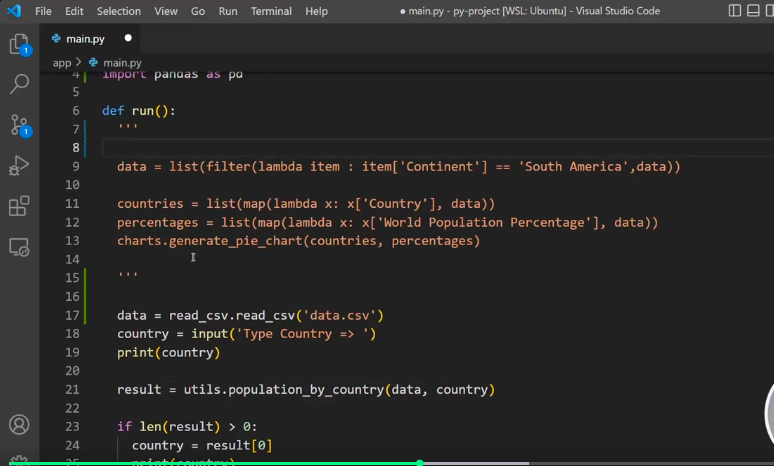

# DATA FRAME

Un DataFrame es una estructura de datos bidimensional (como una tabla) que se usa principalmente en Python con la biblioteca pandas. Es una de las formas más comunes de organizar, analizar y manipular datos en proyectos de análisis de datos, ciencia de datos o programación en general.

📌 Características principales de un DataFrame:
Está compuesto por filas y columnas.

Cada columna puede tener un tipo de dato diferente (números, texto, fechas, etc.).

Tiene índices para identificar las filas.

Permite realizar operaciones como filtrado, ordenamiento, agrupación, combinación, etc.

🔧 ¿Para qué se usa un DataFrame?
Para leer datos de archivos (CSV, Excel, bases de datos, etc.).

Para limpiar y transformar datos.

Para analizar información (calcular promedios, totales, correlaciones, etc.).

Para visualizar datos de forma tabular o generar gráficos.

✅ Ejemplo en Python usando pandas:
python
Copy
Edit
import pandas as pd

# Crear un DataFrame desde un diccionario
data = {
    'Nombre': ['Ana', 'Luis', 'María'],
    'Edad': [23, 35, 29],
    'Ciudad': ['Bogotá', 'Medellín', 'Cali']
}

df = pd.DataFrame(data)

print(df)
Salida:

css
Copy
Edit
  Nombre  Edad    Ciudad
0    Ana    23    Bogotá
1   Luis    35  Medellín
2  María    29      Cali

# Generamos un data frame df en el code de main.py

ver code en main.py linea 16

con estas modificaciones implementando pandas


con lo anterior, corramos main.py (tengamos claro que se cambio el continente por Africa)

```sh
python3 main.py
```

nos solicita un país, puede ser Colombia y la nueva imagen .pie.png ahora mostrara la distribución de paises africanos

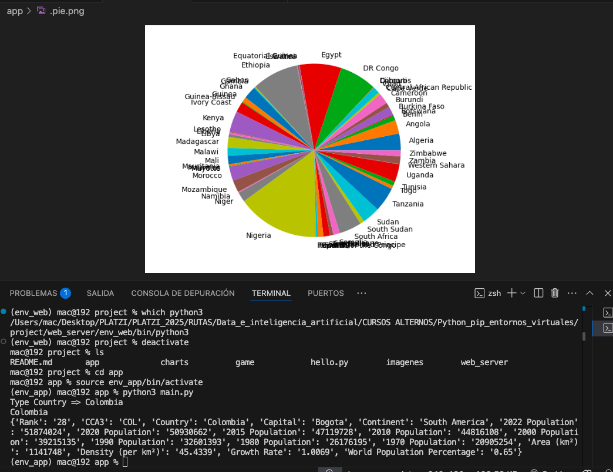

## Python para Backend: web server con FastAPI

"Python para Backend: web server con FastAPI" es un enfoque de desarrollo web donde Python se usa para crear la parte lógica y funcional de una aplicación (el backend), gestionando peticiones, respuestas, bases de datos y reglas del negocio.

FastAPI es un framework moderno y rápido para construir APIs web con Python, diseñado para ofrecer alto rendimiento, facilidad de uso y documentación automática.

Posibles contenidos del tema:

Introducción al Backend

¿Qué es el backend?

Relación con el frontend y bases de datos.

¿Por qué usar FastAPI?

Más rápido que otros frameworks tradicionales como Flask o Django (para APIs).

Soporte para tipado con Python.

Documentación automática con Swagger y Redoc.

Basado en estándares modernos como OpenAPI y JSON Schema.

Creación de un Web Server básico con FastAPI

Instalación del framework (pip install fastapi uvicorn).

Definición de rutas (@app.get(), @app.post(), etc.).

Ejecución del servidor con Uvicorn.

Manejo de rutas, parámetros y peticiones

Parámetros en la URL.

Recibir datos en JSON.

Validación automática con Pydantic.

Integración con bases de datos

Conexión con bases de datos como SQLite, PostgreSQL o MongoDB.

ORM con SQLAlchemy o Tortoise ORM.

Seguridad básica

Manejo de autenticación (token, OAuth2, JWT).

Permisos y autorización.

Despliegue

Cómo poner en producción una API hecha con FastAPI.

Usar servidores como Uvicorn + Gunicorn o desplegar en plataformas como Heroku o Render.

Ventajas clave

Alto rendimiento.

Escalabilidad.

Fácil de mantener y extender.

# Servidor web con python

La libreria que emplearemos es
# fastapi FastAPI

https://fastapi.tiangolo.com/#installation


Primero entremos al proyecto web_server

# web_server

```sh
cd web_server
```

Activamos su entorno virtual:

```sh
source env_web/bin/activate
```

instalamos fastapi:

```sh
pip3 install fastapi
```

seguidamente instalamos uvicorn

```sh
pip3 install "uvicorn[standard]"
```

seguidamente, verificamos que quedo instalado en el entorno

```sh
pip3 freeze
```

nos arroja:

(env_web) mac@192 web_server % pip3 freeze
annotated-types==0.7.0
anyio==4.9.0
certifi==2025.4.26
charset-normalizer==3.4.2
click==8.2.1
fastapi==0.115.12
h11==0.16.0
httptools==0.6.4
idna==3.10
pydantic==2.11.5
pydantic_core==2.33.2
python-dotenv==1.1.0
PyYAML==6.0.2
requests==2.32.4
sniffio==1.3.1
starlette==0.46.2
typing-inspection==0.4.1
typing_extensions==4.14.0
urllib3==2.4.0
uvicorn==0.34.3
uvloop==0.21.0
watchfiles==1.0.5
websockets==15.0.1

despues actualizamos el archivo requeriments.txt

```sh
pip3 freeze > requeriments.txt
```

verificamos que la nuevas librerias de fastapi y uvicorn esten en el archivo requeriments.txt

```sh
cat requeriments.txt
```
Seguidamente entramos a main.py

    Dejaremos la función run, ya establecida pero aqui agregaremos el servidor web.

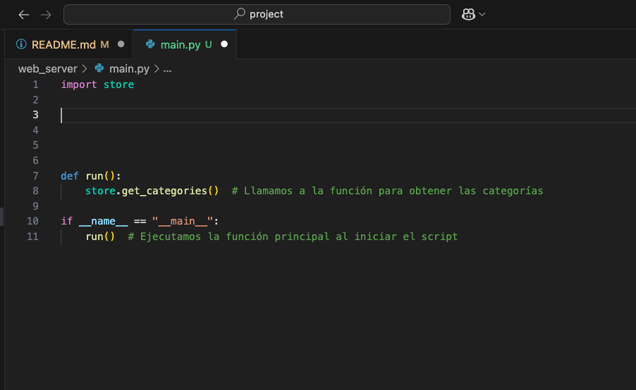 

seguidamente agreramos o importamos la libreria fastapi

y agregamos dos recursos: el de ruta y el de información:

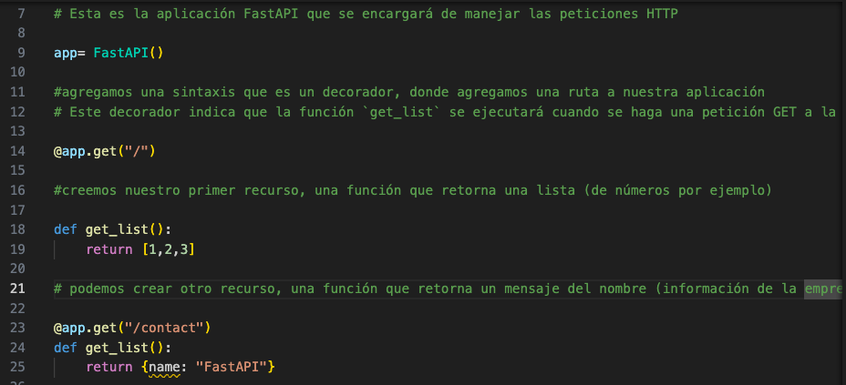

Ahora podemos lanzar el servidor, para esto ejecutamos en la terminal usando uvicorn:

uvicorn (libreria)  main:app (nombre de la aplicación) -- (bandera) reload (para recargar)

```sh
uvicorn main:app --reload
```

obtendremos:

INFO:     Will watch for changes in these directories: ['/Users/mac/Desktop/PLATZI/PLATZI_2025/RUTAS/Data_e_inteligencia_artificial/CURSOS ALTERNOS/Python_pip_entornos_virtuales/project/web_server']
INFO:     Uvicorn running on http://127.0.0.1:8000 (Press CTRL+C to quit)
INFO:     Started reloader process [25357] using WatchFiles
INFO:     Started server process [25367]
INFO:     Waiting for application startup.
INFO:     Application startup complete.

Donde nos dan el IP y el puerto,

para ver este servidor web y puerto corriendo hacemos lo siguiente:

1. abrimos una pestaña en el navegador
2. Escribimos localhost:8000  (el puerto es 8000)

obtenemos en el navegador:

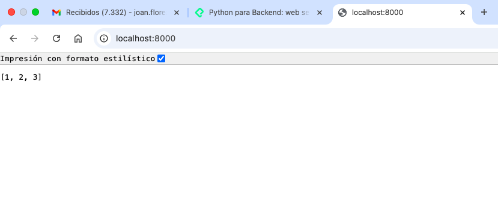

pero hay un error con el recurso de contacto y estaba en name que estaba como variable, se debe poner como str

ahora, ejecutemos en el navegador: localhost:8000/contact

nos arrojara:

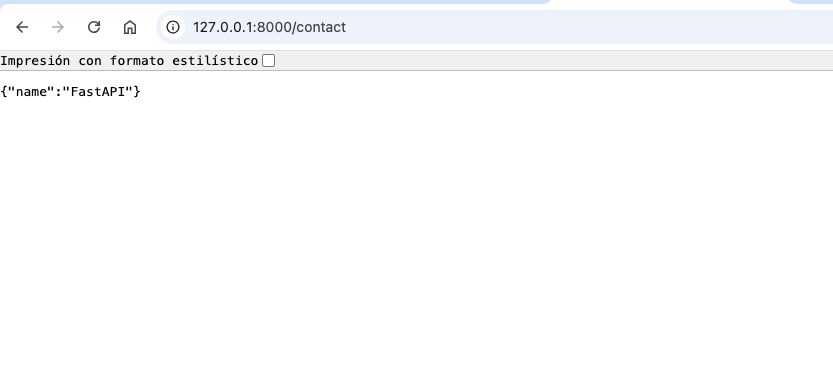
 
En la terminal ctrl + c (par terminar el proceso)

# Obtener paginas dinámicas

Hasta el momendo hemos obtenido array y diccionario, pero si hay forma de obtenerlo de forma dinámica como html, para esto buscamos en la documentación de FastAPI

[text](https://fastapi.tiangolo.com/#installation)

escribimos en buscador: response ....
seleccionamos la documentación de html

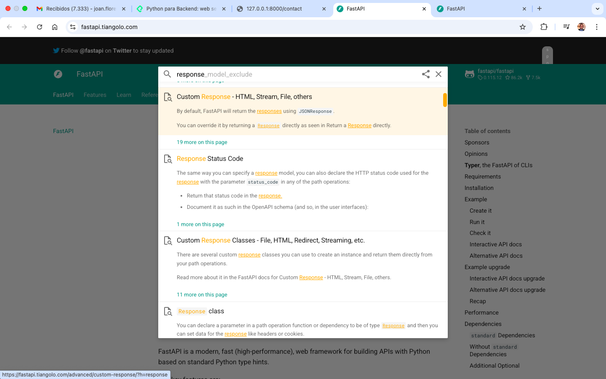

buscamos las importaciones necesarias para dinamizar como html 

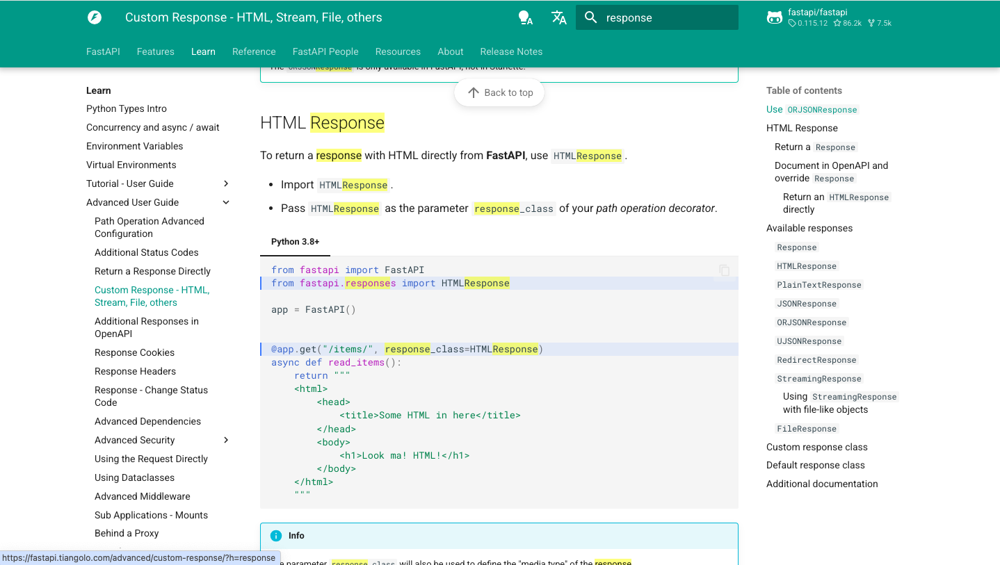

Agregamos a nuestro main.py:

    from fastapi.responses import HTMLResponse


    seguidamente en este recurso:

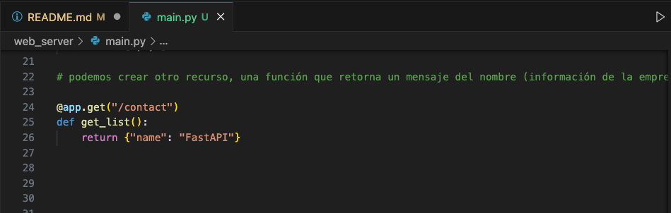

    hacemos los cambios agregando una nueva variable: response_class=HTMLResponse
    y en el return podemos hacer el renderizado de toda una pagina en html

    cambiamos return {"name": "FastAPI"} por return """ code en html """

    obteniedno ahora:

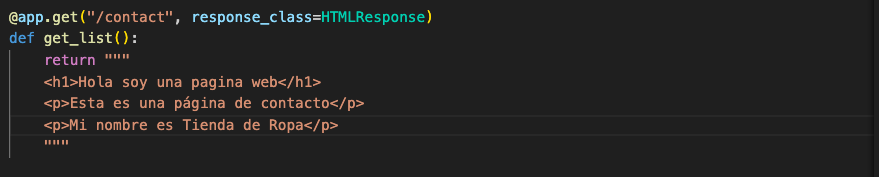 


volvemos a correr:

```sh
uvicorn main:app --reload
```

abrimos en la pagina web el localhost:8000/contact

obtenemos:

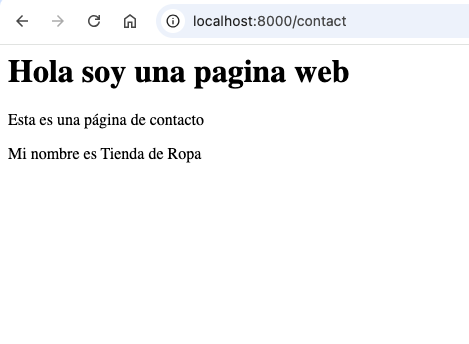 


## DOCKER

https://docs.docker.com/

Es otra herramienta para aislar entornos.

Hasta el momento, tenemos una versión globar de python y librerias si estan en sus entornos virtuales especificos.

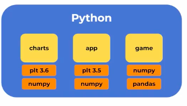 

Es un ambiente muy comun en analisis de datos.

Un posible problema es que al poner en producción la aplicación o proyecto que se este realizando, se debe aislar ahorala versión de Python,

# Docker aisla el proyecto, las dependencias y tambien el entorno de Python.

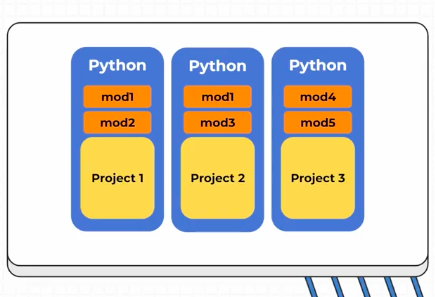

Esto se hace mediante contenedores.

Docker permite que funcione en la computadora, pero adicionalmente se podra desplegar en las diferentes nubes (AWS, AMAZON, etc) 

Dockerizar una aplicación en python.

# Instalación Docker:

Instalación de Docker en Windows, macOS y Ubuntu
Clase 16 de 20 • Curso de Python: PIP y Entornos Virtuales


Clase anterior

Ver clases
Siguiente clase
Según el sistema operativo que utilices puede variar la instalación, así que a continuación te daré las indicaciones base para la instalación según tu sistema operativo:

Instalación en Windows con WSL (Recomendada) 🐧
Debes descargar el instalador desde la página de Docker for Windows.

Cuando ya tienes instalado Docker Desktop dentro de tus programas debes abrirlo y debes asegurarte que la opción "Use the WSL 2 based engine" está habilitada:


WSL

Luego en la sección "Resources > WSL Integration", asegurarate que la opcion "Enable integration with my default WSL distro", este habilitada:


Resources

Puedes ver más detalles de Docker con WLS 👉 Docker Desktop WSL 2 backend

Instalación en Windows 🪟
Debes descargar el instalador desde la página de Docker for Windows.

Cuando ya tienes instalado Docker Desktop dentro de tus programas, una de las cosas que debes tener en cuenta en la instalación con Windows es que debes contar con Windows 10 de 64 Bits o superior y debes habilitar el Hyper-V de Windows.

Si quieres conocer los detalles, aquí te dejo el detalle como habilitar Hyper-V desde la Interfaz de Windows


Hyper-V

Instalación en macOS 🍎
En Mac tienes dos opciones. Todo dependerá si tienes los nuevos chips M1 o Intel, ya que hay un instalable apropiado para ambas arquitecturas de chip. Puedes escoger el instalable desde Install Docker Desktop on Mac.

Adicionalmente, si cuentas con los nuevos chips M1, debes ejecutar la siguiente instrucción en tu terminal softwareupdate --install-rosetta

Una vez descargues el instalador adecuado, solo debes seguir los pasos y pasar Docker Desktop a tus aplicaciones.


# Inicio Docker

Dos tipos de aplicaciones:

1. Una donde corremos scripts
2. Donde tenemos el servidor web pidiendo y recibiendo peticiones.


primero scripts:

    Hasta el momento el proyecto app, es un script que manera modulos para procesar archivos csv.
    En app vamos a crear un archivo llamado Dockerfile (ver codigo)

segundo:
    Creamos un archivo llamero docker-compose.yml, en el declaramos como y de donde se va a iniciar ese contenedor.

Volvemos al archivo Dockerfile y en el creamos el comando de activación 

CMD bash -c "while true; do sleep 1; done"


# EN LA TERMINAL

Para construir el contenedor ejecutamos:(recuerda estar en app)

```sh
docker-compose build 
```

al final arroja:

```sh
 ✔ Service app-csv  Built 
```

Una vez construido ahora se debe lanzar el contenedor:

```sh
docker-compose up -d 
```

arroja:

```sh
[+] Running 2/2
 ✔ Network app_default  Created                                                                                        0.1s 
 ✔ Container app-app-csv-1  Started  
```

para verificar:

```sh
docker-compose ps 
```

arroja:

mac@192 app % docker compose ps
NAME            IMAGE         COMMAND                  SERVICE   CREATED         STATUS         PORTS
app-app-csv-1   app-app-csv   "bash -c 'while true…"   app-csv   2 minutes ago   Up 2 minutes  

# Forma de ingresar al ambiente creado

Ejecutamos:

```sh
docker-compose exec app-csv bash
```

arroja lo siguiente lo cual indica que estamos en el contenedor:

mac@192 app % docker-compose exec app-csv bash
root@31a0144c0dd7:/app# 

Es como estar conectado a un servidor unix (un servidor en la nube)

podemos usar comando similares a los de la terminal

```sh
ls
```

para ver el contenido o

```sh
ls -l
```

arroja:

root@31a0144c0dd7:/app# ls
Dockerfile   charts.py  docker-compose.yml  example.py  main.py      requiriments.txt
__pycache__  data.csv   env_app             imgs        read_csv.py  utils.py

para probar el funcionamiento vamosa ejecutar el archivo main.py

```sh
python3 main.py
```

vemos que el archivo se ejecuta correctamente:

root@31a0144c0dd7:/app# python3 main.py
Type Country => Colombia
Colombia
{'Rank': '28', 'CCA3': 'COL', 'Country': 'Colombia', 'Capital': 'Bogota', 'Continent': 'South America', '2022 Population': '51874024', '2020 Population': '50930662', '2015 Population': '47119728', '2010 Population': '44816108', '2000 Population': '39215135', '1990 Population': '32601393', '1980 Population': '26176195', '1970 Population': '20905254', 'Area (km²)': '1141748', 'Density (per km²)': '45.4339', 'Growth Rate': '1.0069', 'World Population Percentage': '0.65'}

# lo que indica que estamos corriendo la aplicación en un contenedor de docker

Esto lo podemos verificar en docker de escritorio:

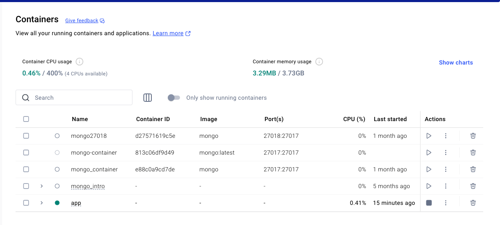

# salir del contenedor:

exit


# Correcciones en docker:

Si por algun motivo hay un error en el contenedor y se desea construir nuevamente, se debe remover y eso se hace con: 

```sh
docker-compose down
```

y se vuelve a levantar el contenedor:

```sh
docker-compose up -d
```

se comprueba:

```sh
docker-compose ps
```

y volvemos a entrar:

```sh
docker-compose exec app_csv bash
```

Ya estamos corriendo nuestrso scripts en contenedores de docker. con esto aislamos en contenedores diferentes lenguajes programación por ejemplo, si hay un trabajo en equipo, esto no obligaría a los demas a instalar lo mismo, porque estaria aislado.


## Docker para el día a día: automatizando la vinculación de archivos

Estando en nuestro proyecto app

primero: lanzamos el funcionamiento del contenedor docker:

```sh
docker-compose up -d 
```

segundo: nos conectamos:

```sh
docker-compose exec app-csv bash
```

Una vez conectados: 

root@31a0144c0dd7:/app# 

verificamos los archivos exitentes:

```sh
ls
```

tercero: abramos charts.py

```sh
cat charts.py
```

veremos el contenido del archivo:

```python
import matplotlib.pyplot as plt

def generate_bar_chart(name, labels, values):
  fig, ax = plt.subplots()
  ax.bar(labels, values)
  plt.savefig(f"./imgs/{name}.png")   #le colocamos el nombre bar
  plt.close()

def generate_pie_chart(labels, values):
  fig, ax = plt.subplots()
  ax.pie(values, labels=labels)
  ax.axis('equal')
  plt.savefig(".pie.png")   #le colocamos el nombre pie
  plt.close()

if __name__ == '__main__':
  labels = ['a', 'b', 'c']
  values = [10, 40, 800]
  # generate_bar_chart(labels, values)
```

vamos a cambiar el nombre: plt.savefig(".pie.png")  por plt.savefig(".chart_pie.png")

guardamos con el cambio y volvemos a revisar el archivo desde el contenedor docker:

```sh
cat charts.py
```

# El cambio no fue guardado

Para ver el cambio, tendriamos que salir con exit y ejecutar:

```sh
docker compose build 
```
y continuar los demas paso. lo cual puede generar fricción y problemas en la experiencias de desarrollo.

# Automatizar cambios en los archivos

Entramos al archivo docker-compose.yml

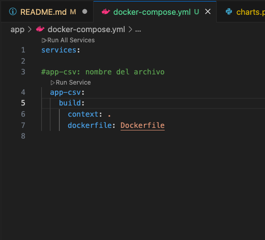

En el archivo creamos volumes, ver code:

    volumes:
      - ./app:/app

      . significa enlazar todo, y el / es el enlace


Seguidamente, vamos a verificar que docker haga los cambios:

1. ejecutamos (para crear los cambios en docker):
```sh
docker-compose up -d 
```

2. luego, el comando para ingresar: 

```sh
docker-compose exec app-csv bash 
```

3. una vez dentro del sistema docker, abrimos el archivo chats.py

```sh
cat charts.py
```

Con esto, los cambios que hagamos en los archivos del proyecto app se enlazaran automaticmanete. 

# En docker en este proyecto hemos corrido scripts, pero la idea espoder correr servidores. 

# Ahora vamos a correr nuestro proyecto web_server

## Docker web_server

1. Copiamos el archivo Dockerfile y docker-compose.yml que estan en app, lo pegamos en el proyecto web_server

2. En el archivo Dockerfile, cambiamos la linea 15

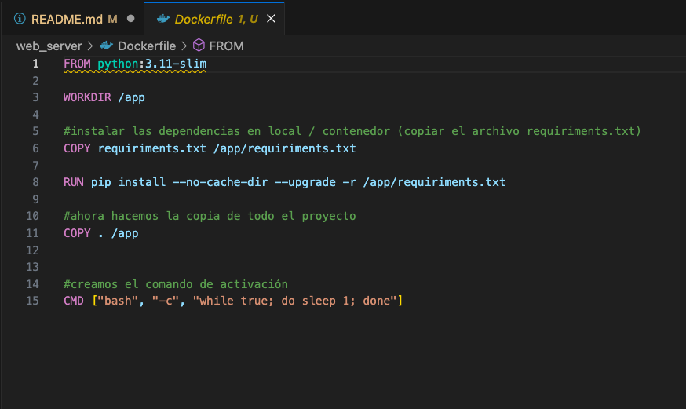

CMD ["uvicorn", "main:app", "--host", "0.0.0.0","--port","80" ]


3. En el archivo docker-compose.yml

cambiamos unos datos:

 -el nombre del proyecto en la linea 4

 -debajo de volumes (que son la conexión con los repositorios), creamos la conexión con los puertos con 
 
  ports:                   #puerto de la aplicacion
      - "8000:8000"


4. ejecutamos en la terminal:

entramos al proyecto:

```sh
cd web_server
```

construimos el contendor: (debe estar corriendo Docker en nuestro servidor)

```sh
docker-compose build
```

ahora vamos a levantar el contenedor:

```sh
docker-compose up -d
```

comprobamos la creación del contenedor:

```sh
docker-compose ps
```

seguidamente corremos en el navegador:

http://localhost:8000

http://localhost:8000/contact


# Hemos dockerizado una pagina web


Ramas:

-Desarrollo web
-Data
-Segurity


siguiente curso recomendado:Curso de Fundamentos de Procesamiento de Lenguaje Natural con Python y NLTK

Volver a la ruta de: Data e inteligencia artificial
